```mermaid
sequenceDiagram
    participant User
    participant Frontend
    participant Wallet
    participant Router as UniswapV2Router
    participant Pair as BAZ/WMANTLE Pair

    User->>Frontend: Enter swap amount (e.g., 100 BAZ → WMANTLE)
    Frontend->>Router: Get output amount quote
    Router->>Pair: Read pool reserves (BAZ, WMANTLE)
    Pair-->>Router: Return reserves
    Router-->>Frontend: Calculate output (with 0.3% fee)
    Frontend-->>User: Show exchange rate & fees
    
    User->>Wallet: Approve BAZ token spend
    Wallet-->>Frontend: Approval confirmed
    
    User->>Frontend: Click "Swap"
    Frontend->>Router: Execute swap transaction
    Router->>Pair: Swap tokens (x*y=k formula)
    Pair->>Pair: Update reserves + fees
    Pair-->>User: Receive WMANTLE tokens

    Note over Frontend: Fee (0.3%) sent to Liquidity Providers
```

```mermaid
sequenceDiagram
    participant User
    participant Frontend
    participant MasterChef
    participant BAZToken

    User->>Frontend: View Farm dashboard
    Frontend->>MasterChef: Get pending rewards & pool info
    MasterChef-->>Frontend: Return pending BAZ, APR, total staked
    Frontend-->>User: Display: "Pending: 50 BAZ | APR: 285%"
    
    User->>Frontend: Enter LP amount to stake (e.g., 10)
    User->>Frontend: Click "Stake LP Tokens"
    Frontend->>MasterChef: Deposit LP tokens
    MasterChef->>MasterChef: Record user deposit
    
    loop Every Block (~5 seconds)
        MasterChef->>MasterChef: Emit 10 BAZ total
        MasterChef->>User: Award BAZ proportionally
    end

    User->>Frontend: Click "Harvest" anytime
    Frontend->>MasterChef: Claim pending rewards
    MasterChef->>BAZToken: Transfer BAZ to user
    BAZToken-->>User: Receive BAZ tokens 💎
```

# 🎯 Bazigr DeFi Platform

**Live Demo:** [https://bazigr-app.vercel.app/](https://bazigr-app.vercel.app/)  
**Network:** Mantle Sepolia Testnet  

---

## 📋 Smart Contract Addresses (Mantle Sepolia Testnet)

| Contract | Address | Explorer |
|----------|---------|----------|
| **BAZ Token** | `0x0e4D19ac0ed1CAa536A90C9bb06B6167F1341AFF` | [View](https://sepolia.mantlescan.xyz/address/0x0e4D19ac0ed1CAa536A90C9bb06B6167F1341AFF) |
| **WMANTLE (Wrapped Mantle)** | `0x1aeE0246D98D220aCCEDD8898E24A418EC65C57c` | [View](https://sepolia.mantlescan.xyz/address/0x1aeE0246D98D220aCCEDD8898E24A418EC65C57c) |
| **UniswapV2 Factory** | `0x26d96DCd0723305f32a32AC5A1bC58928CfE314f` | [View](https://sepolia.mantlescan.xyz/address/0x26d96DCd0723305f32a32AC5A1bC58928CfE314f) |
| **UniswapV2 Router** | `0xa478C958d3b26D1Da146f7Ae6263AA17AFF7Bc8F` | [View](https://sepolia.mantlescan.xyz/address/0xa478C958d3b26D1Da146f7Ae6263AA17AFF7Bc8F) |
| **MasterChef (Farming)** | `0x82631dAb37ec2E3103053036451C9a193F5c05B2` | [View](https://sepolia.mantlescan.xyz/address/0x82631dAb37ec2E3103053036451C9a193F5c05B2) |
| **BAZ/WMANTLE Liquidity Pair** | `0x97Ba9f0A85A4E2FdCbd21a16927FEe4aC47E28fB` | [View](https://sepolia.mantlescan.xyz/address/0x97Ba9f0A85A4E2FdCbd21a16927FEe4aC47E28fB) |
| **SWAP** | `0x674DEB50b0402bca07c97c1DD34eeD4f9648eE79` | [View](https://sepolia.mantlescan.xyz/address/0x674DEB50b0402bca07c97c1DD34eeD4f9648eE79) |
| **Bridge** | `0x118b30B86500239442744A73F1384D97F8C9B63C` | [View](https://sepolia.mantlescan.xyz/address/0x118b30B86500239442744A73F1384D97F8C9B63C) |


---

## 🎨 Project Overview

**Bazigr** is a **gamified DeFi platform** built on the **Mantle Sepolia Testnet**, designed to make decentralized finance fun, interactive, and rewarding for users of all skill levels.

The platform provides a complete decentralized exchange (DEX) experience with **automated market making (AMM)**, **liquidity pools**, and **yield farming** capabilities. Users can **swap tokens**, **provide liquidity**, and **stake LP tokens** to earn rewards while building their on-chain reputation through activity tracking and rewards.

---

## 🏗️ Project Architecture

```mermaid
graph TB
    subgraph Frontend["🖥️ Frontend Layer (Next.js)"]
        UI["UI Components<br/>- Swap Interface<br/>- Liquidity Pool Manager<br/>- Farm Dashboard"]
        Hooks["Custom Hooks<br/>- useSwap()<br/>- useLiquidity()<br/>- useFarm()"]
        Context["React Context<br/>- Wallet State<br/>- User Balances<br/>- Transaction Status"]
    end

    subgraph Web3["⛓️ Web3 Integration Layer"]
        Wagmi["Wagmi + AppKit<br/>(Wallet Connection)"]
        Ethers["Ethers.js<br/>(Contract Interaction)"]
    end

    subgraph Contracts["📝 Smart Contracts (Mantle Sepolia)"]
        Router["🔄 UniswapV2Router<br/>0xa478C958..."]
        Factory["🏭 UniswapV2Factory<br/>0x26d96DCd..."]
        MasterChef["🌾 MasterChef<br/>0x82631dAb..."]
        Tokens["💰 Tokens<br/>- BAZ: 0x0e4D19ac...<br/>- WMANTLE: 0x1aeE0246..."]
        Pair["🔗 BAZ/WMANTLE Pair<br/>0x97Ba9f0A..."]
    end

    subgraph Blockchain["⛓️ Mantle Sepolia Blockchain"]
        Chain["Blockchain Network<br/>- Chain ID: 5003<br/>- RPC: rpc.sepolia.mantle.xyz"]
    end

    UI --> Hooks
    Hooks --> Context
    Context --> Web3
    Wagmi --> Ethers
    Ethers --> Contracts
    Router --> Factory
    Router --> Tokens
    Router --> Pair
    MasterChef --> Tokens
    MasterChef --> Pair
    Contracts --> Chain
```
 


---

## 🚀 Core Features

### 1️⃣ **🔄 Swap - Token Exchange**

**Purpose:** Trade between **BAZ** and **WMANTLE** with minimal fees and slippage protection.

#### How It Works:


#### Key Features:
- ✅ **0.3% Trading Fee** - Distributed to liquidity providers
- ✅ **5% Slippage Protection** - Prevents sandwich attacks
- ✅ **Real-time Pricing** - Based on pool reserves (constant product formula: x × y = k)
- ✅ **Minimal Gas Costs** - Optimized for Mantle network

#### User Flow:
1. Navigate to **Swap** tab
2. Select token: **BAZ** or **WMANTLE**
3. Enter amount to swap
4. Review exchange rate (automatically calculated)
5. Click "Approve" (if first time) → Sign transaction
6. Click "Swap" → Sign transaction
7. Receive tokens instantly ⚡

---

### 2️⃣ **💧 Liquidity - Provide Capital to Pool**

**Purpose:** Earn trading fees by providing liquidity to the **BAZ/WMANTLE** pool.

#### How It Works:


#### What Happens:
- 📊 **Deposit Equal Value** - 100 BAZ + 0.5 WMANTLE (approximately equal USD value)
- 🎟️ **Receive LP Tokens** - Represents your share of the pool
- 💰 **Earn Trading Fees** - 0.3% of every swap, proportional to your share
- 🔐 **Keep Your Funds** - You always own and can withdraw your liquidity

#### Economics Example:
```
Pool Total: 1000 BAZ + 5 WMANTLE = 1000 LP Tokens
Your Add: 100 BAZ + 0.5 WMANTLE → You get ~100 LP tokens (10% share)

Daily Swaps: $10,000 volume × 0.3% fee = $30 in fees
Your Share: 10% × $30 = $3 earned per day
```

#### User Flow:
1. Navigate to **Liquidity** tab
2. **Step 1: Wrap MNT (if needed)**
   - Enter MNT amount
   - Click "Wrap MNT" → Sign transaction
   - Get WMANTLE tokens
3. **Step 2: Add Liquidity**
   - Enter BAZ amount (e.g., 100)
   - System auto-calculates WMANTLE ratio
   - Approve BAZ → Sign
   - Approve WMANTLE → Sign
   - Add Liquidity → Sign
4. **Receive LP Tokens** ✅
5. Go to **Farm** tab to stake and earn BAZ rewards

#### Remove Liquidity:
1. Click "Remove Liquidity"
2. Enter LP amount to burn
3. Receive BAZ + WMANTLE proportionally
4. Exit position completely

---

### 3️⃣ **🌾 Farm - Stake LP Tokens for Rewards**

**Purpose:** Earn **BAZ token rewards** by staking your LP tokens in the **MasterChef** contract.

#### How It Works:


#### Economics Example:
```
Total Staked in Pool: 1000 LP tokens
Your Stake: 100 LP tokens (10% of pool)

Daily Blocks: ~17,280 (5-second blocks)
Daily Rewards: 17,280 blocks × 10 BAZ/block = 172,800 BAZ/day (total pool)
Your Daily Reward: 10% × 172,800 BAZ = 17,280 BAZ/day

APR Calculation:
If BAZ price = $0.01
Your daily earnings = 17,280 × $0.01 = $172.80/day
Annual = $172.80 × 365 = $63,072/year
On $10,000 investment (100 LP × $100) = 630% APR
```

#### Key Features:
- ✅ **10 BAZ per block** - Consistent reward rate
- ✅ **No Lock-up Period** - Unstake anytime
- ✅ **Compound Growth** - Harvest & re-stake rewards
- ✅ **Real-time Tracking** - Pending rewards update every block (~5 seconds)
- ✅ **Emergency Withdraw** - Always exit if needed

#### User Flow:
1. **Have LP Tokens** - Complete Liquidity step first
2. Navigate to **Farm** tab
3. See:
   - Pending Rewards (BAZ owed to you)
   - Reward Rate (10 BAZ/block)
   - Pool APR (%)
   - Total Staked (LP tokens in pool)
4. **Stake LP:**
   - Enter amount
   - Approve LP tokens → Sign
   - Click "Stake" → Sign
5. **Earn Rewards:**
   - Rewards accumulate automatically every ~5 seconds
   - View "Pending Rewards" anytime
6. **Harvest (Claim):**
   - Click "Harvest Rewards"
   - Receive BAZ tokens instantly
   - Start earning again from 0
7. **Compound (Optional):**
   - Swap earned BAZ for WMANTLE
   - Add liquidity again
   - Stake LP for exponential growth
8. **Unstake (Exit):**
   - Enter LP amount to withdraw
   - Automatic harvest of pending rewards
   - Exit position completely

---

## 📊 User Journey & Interaction Flow

### Complete User Path (Beginner to Farmer)

```mermaid
graph LR
    A["🚀 START<br/>Connect Wallet"] --> B["1️⃣ Get Tokens<br/>BAZ from faucet"]
    B --> C["2️⃣ Wrap MNT<br/>MNT → WMANTLE"]
    C --> D["3️⃣ Add Liquidity<br/>BAZ + WMANTLE → LP Tokens"]
    D --> E["4️⃣ Approve LP<br/>Grant permission"]
    E --> F["5️⃣ Stake LP<br/>Start earning BAZ"]
    F --> G["6️⃣ Harvest<br/>Claim rewards"]
    G --> H["7️⃣ Compound<br/>Repeat cycle"]
    H --> I["💰 Earnings<br/>Account Growth"]
    
    style A fill:#FF6B6B
    style F fill:#4CAF50
    style I fill:#FFD700
```



### Feature Interaction Timeline

```mermaid
timeline
    title Daily Bazigr DeFi User Activities
    
    section Morning
      8:00 AM : Check Dashboard : View pending rewards
      8:15 AM : Harvest Rewards : Claim earned BAZ
    
    section Midday
      12:00 PM : Monitor Position : Check LP value
      12:30 PM : Optional Swap : Trade BAZ/WMANTLE
    
    section Afternoon
      3:00 PM : Check Prices : Monitor market
      3:30 PM : Compound (Optional) : Re-stake rewards
    
    section Evening
      6:00 PM : Review Earnings : Daily P&L
      7:00 PM : Plan Next Day : Decide add/remove liquidity
```

---

## 📊 Dashboard Metrics

The **Dashboard** displays real-time information:

| Metric | Description | Updates |
|--------|-------------|---------|
| **BAZ Balance** | Your available BAZ tokens | Every 10s |
| **WMANTLE Balance** | Your wrapped Mantle for trading | Every 10s |
| **LP Token Balance** | Your pool share tokens | Every 10s |
| **MNT Balance** | Native MNT for gas fees | Every 10s |
| **Pending Rewards** | BAZ owed to you from farming | Every block (~5s) |
| **Pool TVL** | Total value locked (BAZ + WMANTLE) | Every block |
| **APR** | Annual percentage return for farmers | Real-time |
| **Your Share %** | Your portion of the pool | Every block |

---

## 🏗️ Technology Stack

### Frontend
- **Framework:** Next.js 14+ (TypeScript)
- **UI Components:** Radix UI, Tailwind CSS
- **Animations:** Framer Motion
- **Wallet:** @reown/appkit (formerly WalletConnect)
- **Web3:** wagmi, ethers.js
- **State:** React Context API, TanStack Query

### Smart Contracts
- **Language:** Solidity 0.8+
- **DEX:** Uniswap V2 Fork (Factory + Router + Pair)
- **Farming:** MasterChef (Yield Farming)
- **Token:** ERC20 (BAZ) + Wrapped Native (WMANTLE)
- **Network:** Mantle Sepolia Testnet (Chain ID: 5003)
- **Framework:** Hardhat
- **Testing:** Mocha + Ethers.js + OpenZeppelin

### Infrastructure
- **Deployment:** Vercel
- **RPC:** Mantle Sepolia (https://rpc.sepolia.mantle.xyz)
- **Explorer:** Mantle Sepolia Explorer (sepolia.mantlescan.xyz)

---

## 🔧 Developer Integration Guide

### Setting Up Locally

```bash
# Clone repository
git clone <repo-url>
cd Bazigr

# Install dependencies
bun install

# Set up environment variables
cp .env.example .env.local

# Start development server
bun run dev
```

### Contract Interaction Example

```javascript
import { ethers } from 'ethers';

const CONTRACTS = {
  ROUTER: '0xa478C958d3b26D1Da146f7Ae6263AA17AFF7Bc8F',
  MASTERCHEF: '0x82631dAb37ec2E3103053036451C9a193F5c05B2',
  BAZ: '0x0e4D19ac0ed1CAa536A90C9bb06B6167F1341AFF',
  WMANTLE: '0x1aeE0246D98D220aCCEDD8898E24A418EC65C57c',
};

// Initialize contract
const router = new ethers.Contract(
  CONTRACTS.ROUTER,
  routerABI,
  signer
);

// Example: Swap BAZ for WMANTLE
const path = [CONTRACTS.BAZ, CONTRACTS.WMANTLE];
const deadline = Math.floor(Date.now() / 1000) + 1200;

await router.swapExactTokensForTokens(
  ethers.parseEther('100'),  // 100 BAZ
  0,                          // min output
  path,
  userAddress,
  deadline
);
```

---

## ⚙️ Contract Parameters & Economics

### UniswapV2 Configuration
- **Trading Fee:** 0.3% per swap
- **Fee Destination:** 100% to Liquidity Providers
- **Price Formula:** Constant Product (x × y = k)

### MasterChef Configuration
- **Reward Rate:** 10 BAZ per block
- **Start Block:** 33,468,904 (Mantle Sepolia)
- **Pool 0 Allocation:** 100 points (100% of rewards)
- **Withdraw Fee:** None (flexible farming)

### WMANTLE Specifications
- **Decimals:** 18
- **1 WMANTLE = 1 MNT**
- **Wrap/Unwrap:** 1:1 ratio

---

## 🔒 Security & Best Practices

### ✅ Implemented Security Measures
- ReentrancyGuard on all critical functions
- SafeERC20 for safe token transfers
- OpenZeppelin Access Control
- Overflow protection (Solidity 0.8+)
- Emergency withdraw functionality

### ⚠️ User Best Practices
- Start with small amounts to test
- Always verify transaction details before signing
- Keep some MNT for gas fees (~0.01 MNT minimum)
- Never share your private key or seed phrase
- Use only official Bazigr website
- Double-check contract addresses on Mantle Explorer

---

## 🚀 Getting Started (Quick Start)

### For New Users
1. **Connect Wallet** → Use Mantle Sepolia testnet
2. **Get Tokens** → Request BAZ from faucet
3. **Wrap MNT** → Convert native MNT to WMANTLE
4. **Add Liquidity** → Provide BAZ + WMANTLE to pool
5. **Stake LP** → Deposit LP tokens to farm
6. **Earn & Harvest** → Claim BAZ rewards

### For Developers
1. **Clone Repo** → Get all source code
2. **Install Contracts** → `cd smart-contracts && npm install`
3. **Deploy** → `npx hardhat run scripts/deploy-mantle.ts --network mantleSepolia`
4. **Integrate** → Use contract ABIs from `artifacts/`
5. **Test** → Run test suite: `npm test`

---

## 📱 Supported Features

- ✅ **Token Swapping** - Trade BAZ ↔ WMANTLE
- ✅ **Liquidity Provision** - Add/remove liquidity
- ✅ **Yield Farming** - Stake LP for BAZ rewards
- ✅ **Real-time Dashboard** - View balances & rewards
- ✅ **Mobile Responsive** - Full mobile support
- ✅ **Wallet Integration** - Multi-wallet support
- ✅ **Transaction Tracking** - View all transactions

---

## 📞 Support & Resources

### Contract Verification
- [BAZ Token](https://sepolia.mantlescan.xyz/address/0x0e4D19ac0ed1CAa536A90C9bb06B6167F1341AFF)
- [WMANTLE](https://sepolia.mantlescan.xyz/address/0x1aeE0246D98D220aCCEDD8898E24A418EC65C57c)
- [UniswapV2 Router](https://sepolia.mantlescan.xyz/address/0xa478C958d3b26D1Da146f7Ae6263AA17AFF7Bc8F)
- [MasterChef](https://sepolia.mantlescan.xyz/address/0x82631dAb37ec2E3103053036451C9a193F5c05B2)

### Documentation
- 📖 [DEFI_USER_GUIDE.md](./DEFI_USER_GUIDE.md) - Complete user guide
- 📋 [DEPLOYMENT_SUMMARY_DEFI.md](./smart-contracts/DEPLOYMENT_SUMMARY_DEFI.md) - Technical details
- 🔧 [FRONTEND_INTEGRATION.md](./smart-contracts/FRONTEND_INTEGRATION.md) - Developer guide

### Network Info
- **Network:** Mantle Sepolia Testnet
- **Chain ID:** 5003
- **RPC:** https://rpc.sepolia.mantle.xyz
- **Explorer:** https://sepolia.mantlescan.xyz/

---

## 📈 Roadmap & Future Features

- 🔮 **AI DeFi Agent** - Smart recommendations for farming strategies
- 🎮 **Mini-Games** - Play-to-earn mechanics
- 🏆 **Leaderboard** - Competitive trading rankings
- 🌉 **Cross-Chain Bridge** - Multi-network support
- 💳 **Lending/Borrowing** - Additional DeFi primitives
- 🎨 **NFT Badges** - Achievement collection

---

## 📄 License

This project is licensed under the MIT License. See the [LICENSE](./LICENSE) file for details.

---

**🎉 Start your DeFi journey with Bazigr today!**

**Network:** Mantle Sepolia | **Chain ID:** 5003  
**Version:** 1.0 | **Last Updated:** January 15, 2026
